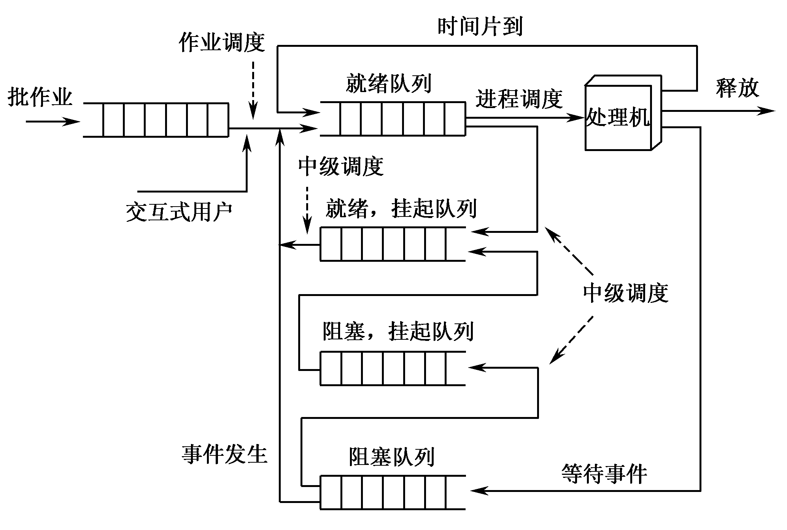
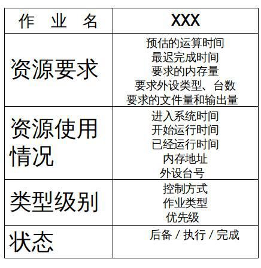
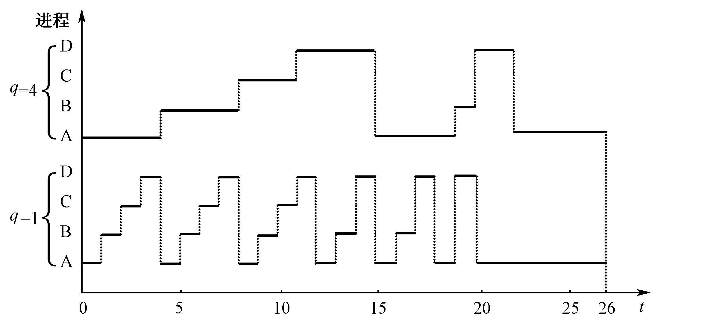

# 处理机调度
描述：处理机调度的主要目的就是分配处理机
  - **调度** 的功能是组织和维护就绪进程队列。包括确定调度算法、按调度算法组织和维护就绪进程队列
  - **分派** 的功能是指当处理机空闲时，从就绪队列队首中移出一个PCB，并将该进程投入运行。

调度级别
  - 高级调度：作业调度或长期调度（用户的交互等高级业务，属于宏观调度）
  - 中级调度：中期调度（调度就绪、阻塞队列）
  - 低级调度：进程调度或短期调度（属于微观调度）

## 作业与进程调度

作业调度（接纳调度）的主要功能是根据作业控制块中的信息，审查系统能否满足用户作业的资源需求，以及按照一定的算法，从外存的后备队列中选取某些作业调入内存，并为它们**创建进程、分配必要的资源**。然后再将新创建的进程插入就绪队列，准备执行

作业调度的基础：PCB包含了程序的上下文、资源表

**作业调度是宏观调度，进程调度是微观调度**

### 作业调度的功能
1. **记录** 系统中各个作业的情况
2. 按照某种调度算法从后备作业队列中 **挑选** 作业
3. 为选中的作业 **分配** 内存和外设等资源
4. 为选中的作业建立相应的进程，并把该进程 **放入就绪队列** 中
5. 作业结束后进行 **善后** 处理工作

### 作业控制块JCB

### 作业调度过程
1. **提交** 状态：用户向系统提交一个作业
2. **后备** 状态：作业送入输入井中存放，等待进入内存
3. **执行** 状态：作业被调入内存，并在CPU上执行
4. **完成** 状态：完成计算任务，由系统回收资源，准备退出系统

## 处理机调度算法
性能评价标准
- CPU利用率
- 吞吐量
- <codepub>周转时间</codepub>：从作业提交到完成的时间间隔
  $$周转时间=等待执行时间+执行时间$$
  - <codepub>平均周转时间</codepub>：一系列作业从提交到完成的时间间隔的平均和，用于衡量不同调度算法对相同作业流的调度性能
  $$平均周转时间=\sum_{i=1}^{n}周转时间/n$$
  - <codepub>带权周转时间</codepub>：周转时间占实际运行时间的多少，即用来反映等待时间占的比重，反映作业（或进程）长短问题
  $$带权周转时间=\frac{周转时间}{执行时间}=\frac{等待执行时间+执行时间}{执行时间}$$
  - <codepub>平均带权周转时间</codepub>：同上
- 就绪等待时间
- 响应时间

### <codepub>FCFS先来先服务</codepub>
比较有利于长作业（进程），而不利于短作业（进程）
容易实现，但效率较低

### <codepub>SJF短作业优先</codepub>
能有效地降低作业的平均等待时间和提高系统的吞吐量。
对长作业很不利，并且不能保证紧迫性作业会被及时处理。

### <codepub>优先级法</codepub>
确定进程优先级的方式——静态与动态
- 静态优先级是在创建进程时就确定下来的，而且在进程的整个运行期间保持不变。优先数——标示优先级的整数。通常采用“优先数小、优先级高”的表示方式。
- 动态优先级随着进程的推进而不断改变

### <codepub>非剥夺式优先级调度</codepub>
程序按照优先级依次执行完，不接受中断调度
### <codepub>剥夺式优先级调度</codepub>
高优先级进程/线程可剥夺低进程/线程，插入优先

### <codepub>时间片轮转法</codepub>
时间片轮转法（Round-Robin, RR）主要用于分时系统，时间片是一个小的时间单位，通常为10～100 ms数量级。

q为单位时间单位，左边是以4为基的运行调度
时间片的长短通常由以下四个因素确定：
- 系统的响应时间
- 就绪队列进程的数目
- 进程的转换时间
- CPU运行指令速度

### <codepub>实时任务调度</codepub>
- 硬实时任务:系统必须满足任务对截止时间的要求
- 软实时任务:任务与预期的截止时间相关联，但不是绝对严格的
通常实时任务需要被快速且优先执行

