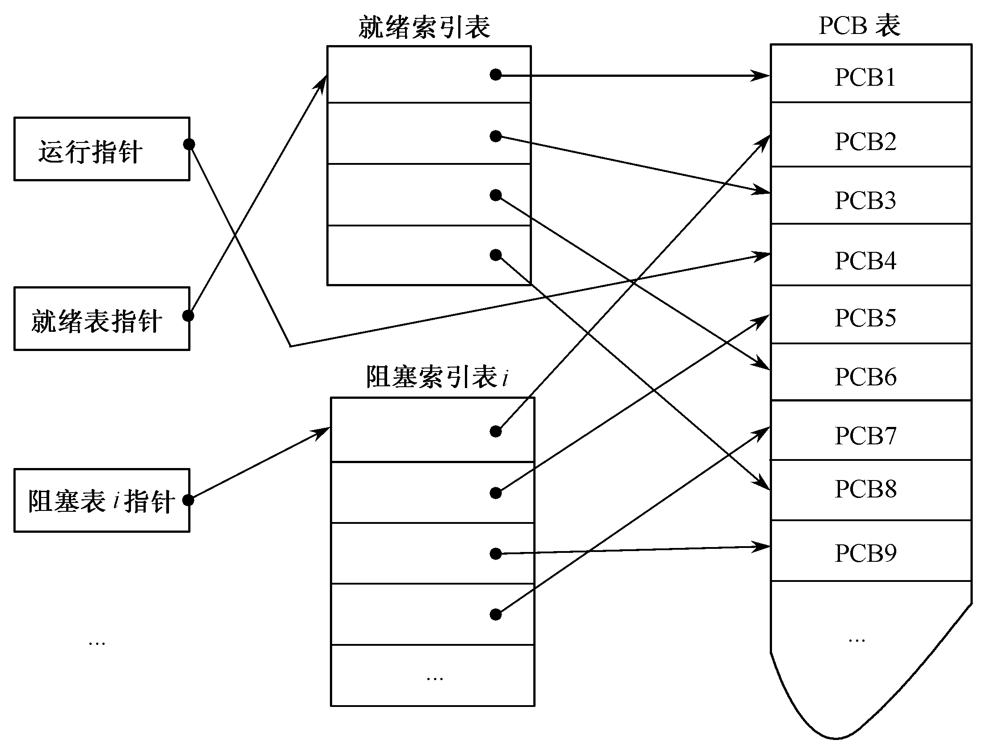
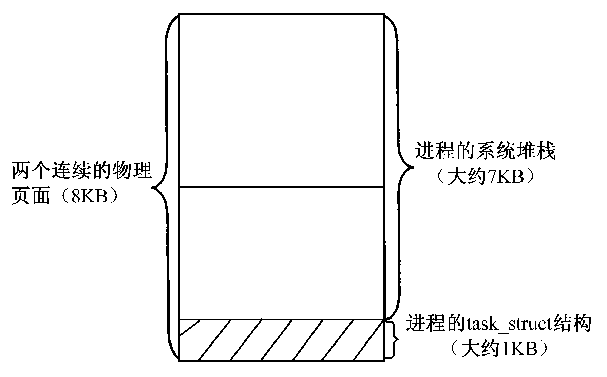

## 进程历史
顺序进程
- 程序顺序执行的特征：**顺序性、封闭性、可再现性**

并发执行
- 非多道：多个程序被载入，程序阻塞、按序完成
- 多道：多个程序被载入，程序按作业需要进行调度，非阻塞切换，宏观表现为并发
- 特征：开放性、程序不等于计算、并发之间存在互相制约。
- 程序的 **可再现性** 是确保并发的前提条件

**进程：程序在并发环境中的执行过程，是电脑中已执行程式的实体**，最本质的属性是**动态性、并发性**，可异步执行、接受调度、具有特殊数据结构。在早期unix系统中是分是系统的基本运作单位，现在不是执行单位，只是线程的容器。

### 进程与程序的区别

|比较|进程|程序|
|--|--|--|
|描述|动态概念，描述执行中的程序|静态概念，描述工作任务与结构|
|独立性|进程是独立运行的单位 系统资源分配、调度的基本单位|不具备独立性，有随意多的副本|
|关系|进程可以调用任意多的程序|程序可以被多个进程共用|
|执行|异步执行、接受调度、互相制约|不具备执行性|

## 进程的结构
1. <codepub>栈</codepub>：存放程序计数器
2. <codepub> PCB </codepub>：程序控制块：最关键的部分，含有进程的描述信息和控制信息，是进程动态特性的集中反映，是系统对进程施行识别和控制的依据。**PCB是进程存在的唯一标识**。
3. <codepub>数据集合</codepub>：运行时数据的集合
4. <codepub>程序</codepub>：静态的内容

#### 进程的特征
  - 拥有自己所用的资源列表
  - 拥有PID唯一外部标识符、进程优先级等信息，供系统调用
  - 是一个程序装载的实体
  
### PCB
一个文件，存储在进程实体中（通过指针）。

#### PCB组织方式
1. <codepub>线性表（单文件结构）</codepub>：所有的进程的PCB都放在同一个文件里，需要的时候就扫描。开销较小，适合小系统。
2. <codepub>链接表（指针+PCB链表结构）</codepub>：系统提供进程调度指针（执行队列指针、就绪队列指针、空闲队列指针、阻塞队列指针），将PCB组成链表，用于一次调用。
3. <codepub>索引表（指针+索引表+PCB地址结构）</codepub>：系统提供调度指针，然后使用一张索引表（从PID到PCB）做映射，修改索引表进行数据修改，避免了直接对PCB的操作，适合相对较大的系统。

#### linux下的PCB
称为task_struct的数据结构，包含了进程状态、调度信息、标识符、内部进程通信、链接信息、时间和计时器、文件系统、虚拟内存、处理器信息
