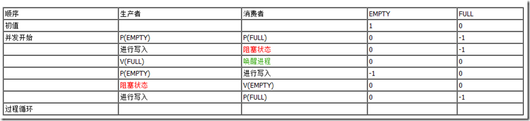

# 进程通信
低级进程通信：**互斥**和**同步**机制，通过**PV操作与信号量**来实现

高级进程通信（逻辑通信）
- <codepub>内存通信</codepub>：通过在程序资源映射表里进行共享内存的指定。
- <codepub>管道通信</codepub>：连接进程的读写（存在互斥、同步等机制）
- <codepub>消息传递系统</codepub>：通常基于OS提供的通信。直接通信包括了像本地环回地址通信，间接通信包括像邮箱等。
- <codepub>CS通信</codepub>：套接字调用、远程软件调用

## 临界区
临界区：描述一个访问共用资源的程序片段，而这些共用资源又无法同时被多个线程访问的特性，**每个进程中访问临界资源的那段代码称为临界区**。

当有线程进入临界区段时，其他线程或是进程必须等待，有一些同步的机制必须在临界区段的进入点与离开点实现，以确保这些共用资源是被互斥获得使用。

进程进入临界区的调度原则
- （进入）有若干进程要求进入空闲的临界区，一次仅允许一个进程进入
- （持有）任何时候，处于临界区内的进程不可多于一个。如已有进程进入自己的临界区，则其它所有试图进入临界区的进程必须等待
- （退出）进入临界区的进程要在有限时间内退出，以便其它进程能及时进入自己的临界区
- （调度）如果进程不能进入自己的临界区，则应让出CPU，避免进程出现“忙等”现象

## PV操作与信号量
信号量：在多线程环境下使用的一种设施，用来保证两个或多个关键代码段不被并发调用（通常信号量以正整数用来表示空闲资源数）

PV操作：P表示通过申请的意思，V表示释放资源的意思

P（S）：①将信号量S的值减1，即S=S-1；②如果S>=0，则该进程继续执行；否则该进程置为等待状态，排入等待队列。

V（S）：①将信号量S的值加1，即S=S+1；②如果S>0，则该进程继续执行；否则释放队列中第一个等待信号量的进程。

## 互斥模型
在互斥模型中，多个进程对可用资源进行争用，使用信号量S表示可用资源的数量。一般来说，信号量S>=0时，S表示可用资源的数量。执行一次P操作意味着请求分配一个单位资源，因此S的值减1；当S<0时，表示已经没有可用资源，请求者必须等待别的进程释放该类资源，它才能运行下去。而执行一个V操作意味着释放一个单位资源，因此S的值加1；若S<=0，表示有某些进程正在等待该资源，因此要唤醒一个等待状态的进程，使之运行下去。

进程互斥是进程之间发生的一种间接性作用，一般是程序不希望的

## 同步模型
进程同步是进程之间直接的相互作用，是合做进程间有意识的行为。与互斥模型不同，进程同步时的信号量只与制约进程、被制约进程有关而不是与所有的同类并发进程有关，所以同步模型中的信号量为私有信号量。

生产者-消费者模型是同步模型的典型代表，其也存在多种情况，分别叙述如下：

1. 一个生产者，一个消费者，共用一个缓冲区。
定义两个同步信号量，生产者需要一个EMPTY信号量来判断当前是否能够写入，设置初值为1，消费者需要一个FULL信号量，来判断当前是否能够读取，设置初值为0。

1. 一个生产者，一个消费者，共用N个缓冲区。
与上面的例子不同的是，EMPTY的初值为N，则生产者的阻塞时间会减少很多。

3. 多个生产者，多个消费者，共用N个缓冲区。
在这种场景下，除了同步之外，还需要在生产者之间、消费者之间进行互斥的访问缓冲区，所以需要设置四个信号量，分别是EMPTY、FULL、生产者之间的互斥信号量Mutex1、消费者之间的互斥信号量Mutex2。
非生产者、消费者模型的例子有一个司机和售票员的。设置RUN信号量供司机判断是否应该开车，初始值为0；设置STOP信号量供售票员判断是否可以开门，初始值为0。描述如下：

> 内容引用自 http://www.cnblogs.com/cocowool/archive/2012/06/11/2544823.html