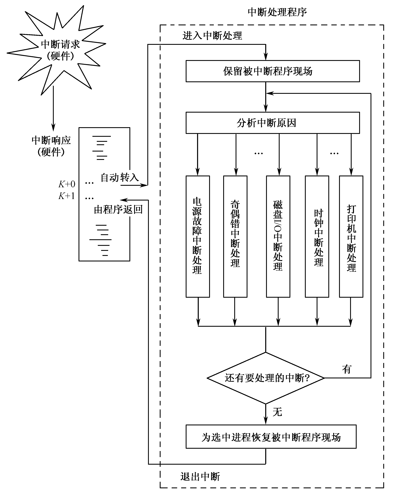
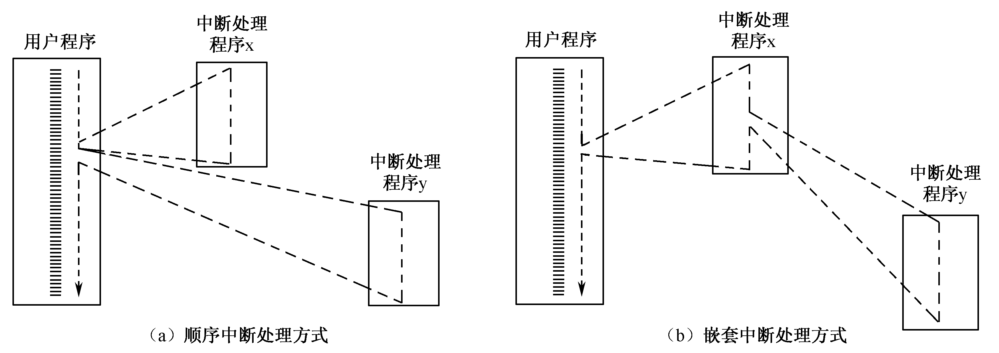
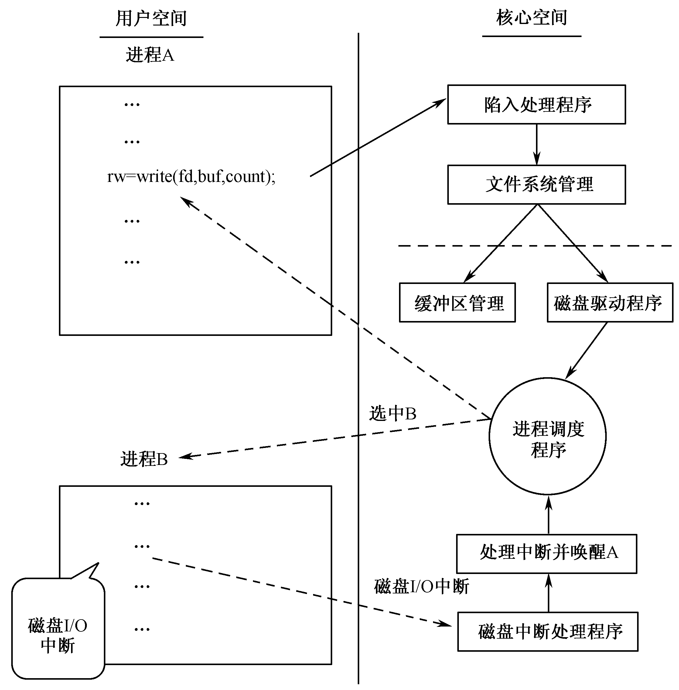

# 中断处理和系统调用

中断一般分为**中断响应**和**中断处理**两个步骤

## <codepub>中断响应</codepub>
由硬件实施
  1. 中止当前程序的执行
  2. 保存原程序的断点信息
  3. 转到相应的处理程序

## <codepub>中断处理</codepub>
由软件（中断处理程序）进行相应处理
  1. 保存被中断程序的现场（集中式保存、分散式保存）
  2. 分析中断原因
  3. 转入相应处理程序进行处理
  4. 恢复被中断程序现场

## 中断优先级和中断屏蔽
  - 中断屏蔽——在提出中断请求之后，CPU不予响应。
  - 中断禁止——在可引起中断的事件发生时系统不接收该中断信号，因而就不可能提出中断请求而导致中断。

## 多重中断

## 系统调用实现过程示例
