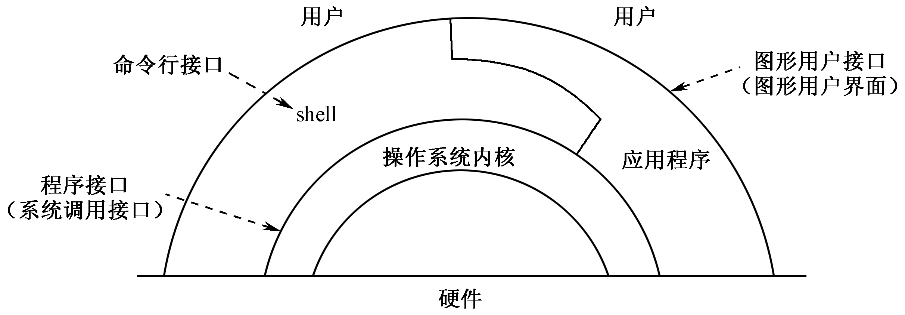
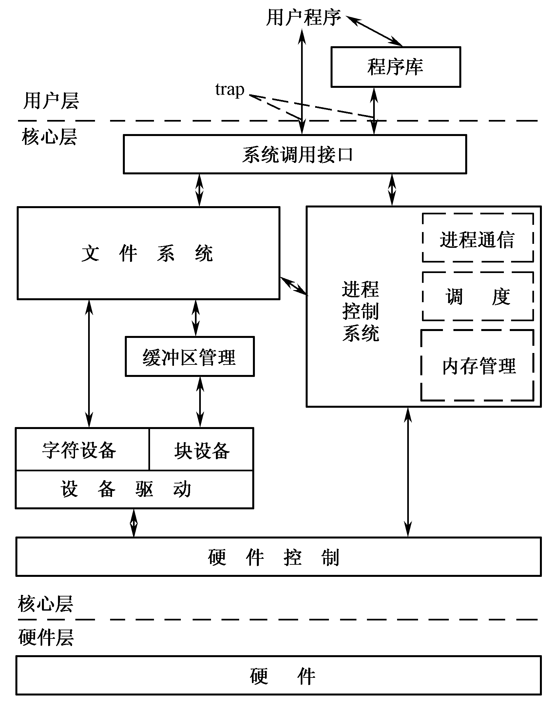

# Kernel

[Linux Kernel Official](https://www.kernel.org/)

Kernel是什么？[wikipedia](https://www.wikiwand.com/zh-hant/%E5%86%85%E6%A0%B8)的介绍是

> 在計算機科學中，內核又稱核心，是一個電腦程式，**用來管理軟體發出的資料I/O要求，將這些要求轉譯為資料處理的指令，交由CPU及電腦中其他電子元件進行處理，是現代操作系統中最基本的部分**。
為眾多應用程序提供對計算機硬件的安全訪問的一部分軟件，這種訪問是有限的，並由內核決定一個程序在什麼時候對某部分硬件操作多長時間。直接對硬件操作是非常複雜的。所以內核通常提供一種硬件抽象的方法，來完成這些操作。通過進程間通信機制及系統調用，應用進程可間接控制所需的硬件資源（特別是處理器及IO設備）。
> 
> 嚴格地說，內核並不是計算機系統中必要的組成部分。程序可以直接地被調入計算機中執行；這樣的設計，說明了設計者不希望提供任何硬件抽象和操作系統的支持。
>
> (有略微删减)

结构简图

实现的核心功能

## 分类
通常在内核设计上，会被分为微内核与宏内核
