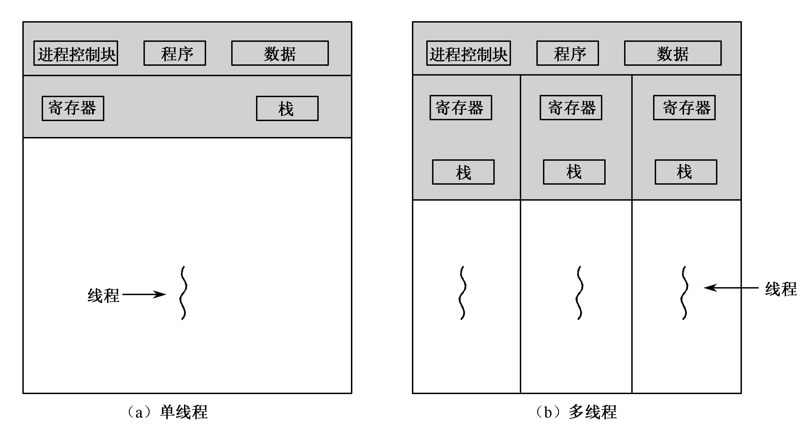
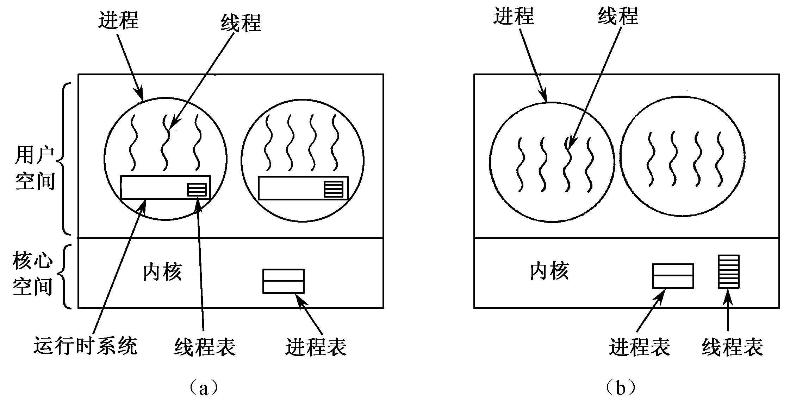

# 线程

> 现代操作系统中，进程只作为资源拥有者，而调度和运行的属性赋予新的实体——线程

引入线程（资源占用与运行调度分离）的好处：
- 不同线程在同一进程中，共享相同的上下文、资源等。
- 易于切换，切换进程的工作是重量级的
- 线程之间没有保护机制，通信需求降低。

结构：thread结构
- 线程标识符
- 一组寄存器
- 私有数据存储区
- 两个栈指针：核心栈、用户栈

## 线程与进程的区别
- 所属关系：进程拥有代码块、数据和引用文件，在进程的基础上每个线程拥有自己的寄存器和栈。
- 数量关系：一个进程可以有多个线程，但至少要有一个线程；而一个线程只能在一个进程的地址空间内活动
- 实际运作：处理机分配给线程，即真正在处理机上运行的是线程
- 通信区别：线程在执行过程中需要协作同步。不同进程的线程间要利用消息通信的办法实现同步

## 双态中的线程

（左：用户线程 右：核心线程）

上面阐述了两种实现的方法，通常来说内核其实是一个pid=0的所有的父线程

用户线程的运行：
  - 优点：切换速度快；调度算法可专用
  - 缺点：阻塞问题；多处理器利用问题

核心线程的运行：
  - 优点：真正实现并行操作、灵活调度阻塞
  - 缺点：控制转移的开销非常大
